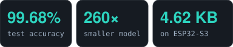
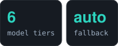
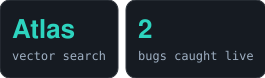
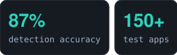
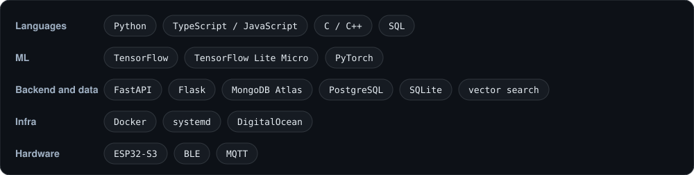
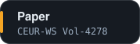

### Hi, I'm Elmir

AI/backend engineer, M.Eng. CS candidate at **Cornell Tech**, building toward founding an AI startup. Background in cybersecurity (B.Sc. honors, M.Sc. in progress), now focused on applied ML systems that ship and hold up under real traffic.

📍 New York, NY · 🎓 Cornell Tech, M.Eng. CS (May 2027)

## Shipped work

<table>
  <tr>
    <td width="50%" valign="top">
      <h3><a href="https://github.com/elmir132/ble_vulnerability_tinyml">TinyML BLE vulnerability detection</a></h3>
      Neural classifier for real-time Bluetooth Low Energy threat detection on embedded hardware.
       Published at <i>CH&amp;CMiGIN-2026</i>, Kraków (<a href="https://ceur-ws.org/Vol-4278/short03.pdf">CEUR-WS Vol-4278</a>, Scopus-indexed).
        
      
        
      <code>TensorFlow Lite Micro</code> <code>ESP32-S3</code> <code>BLE</code>
    </td>
    <td width="50%" valign="top">
      <h3><a href="https://github.com/elmir132/hermes">Hermes, production AI assistant</a></h3>
      Conversational assistant serving live users, with persistent long-term memory and failure resilience. Routes across several models with automatic fallback, RAG over a SQLite vector store, supervised by systemd on a Linux cloud instance.
        
      
        
      <code>Python</code> <code>SQLite</code> <code>systemd</code>
    </td>
  </tr>
  <tr>
    <td width="50%" valign="top">
      <h3><a href="https://github.com/elmir132/mongodb-hackathon">Chronicle, self-healing project memory</a></h3>
      Built the resolution engine for a 4-person team at a MongoDB hackathon: conflict resolution by source authority and recency, and precedent-based policy learning from human corrections. Verified end to end on real MongoDB Atlas.
        
      
        
      <code>Python</code> <code>MongoDB Atlas</code>
    </td>
    <td width="50%" valign="top">
      <h3><a href="https://github.com/elmir132/security-overflow">Security Overflow, OWASP scanner</a></h3>
      Flask scanner that orchestrates Wapiti, SQLMap and Nikto behind one interface, with LLM-generated remediation guidance.
        
      
        
      <code>Flask</code> <code>Wapiti</code> <code>SQLMap</code> <code>Nikto</code>
    </td>
  </tr>
</table>

**More**

- [Rental Law Navigator](https://github.com/elmir132/rental-law-navigator): address-level housing-law lookup where a verifier rejects any quote not literally in the source. Built solo overnight for the Hack-Nation RealPage challenge.
- [Utility Debt Shield](https://github.com/elmir132/utility-debt-shield): prototype API that flags utility activation friction before a lease is signed (mock data only).
- [ClipTidy](https://github.com/elmir132/cliptidy): macOS menu-bar app that cleans clipboard text with one shortcut.
- [Multi-model research orchestrator](https://github.com/elmir132/multi-model-research-orchestrator): CLI that compares several AI providers on one question and shows where they disagree.
- [tuichat](https://github.com/elmir132/terminal-llm-chat): full-screen terminal chat client for Ollama and OpenAI-compatible models.
- [Crypto trend dashboard](https://github.com/elmir132/crypto-trend-dashboard) and [NFT call builder](https://github.com/elmir132/nft-call-builder): small Flask and Node tools on public market data.

## Stack

## Contact

Banner and badges are generated by <a href="scripts/build.py"><code>scripts/build.py</code></a>. Every number comes from the linked project READMEs.
